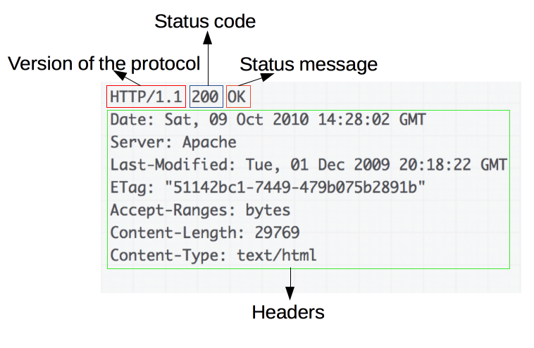

# Workshop Node.js

<!--Breve descrição do projeto aqui -->


## Tecnologias utilizadas

Node.js, Express, PostgreSQL e Sequelize.

<!-- Link com os badges para inserir abaixo https://devicon.dev/ -->
<div style="display: flex; gap: 10px;">
               <!--coloque o link do ícone no src -->
  
  
  
</div>

## Onde Aplicar

Desenvolvimento de API REST

# Sumário

* [Instalações](#instalações)
  * [Pré-Requisitos](#pré-requisitos)
  * [Recursos adicionais](#recursos-adicionais)
* [Roadmap](#roadmap)
  * [STEP 1 - Concepções básicas do Node](#step-1---concepções-básicas-do-node)
  * [STEP 2 - Concepções básicas sobre o NPM](#step-2---concepções-básicas-sobre-o-npm)
  * [STEP 3 - Concepções básicas sobre API REST](#step-3---concepções-básicas-sobre-api-rest)
  * [STEP 4 - Desenvolvimento da Aplicação](#step-4---desenvolvimento-da-aplicação)
* [Contato](#contato)
* [License](#license)


## Instalações

Acesse o site Node.js e baixe a versão LTS e instale em seu computador.

Acesse o site do PostgreSQL e instale em seu computador.
 
### Pré-Requisitos

- **[Node.js](https://nodejs.org/en/download)** 

- **[PostgreSQL](https://www.postgresql.org/download/)**

 API Platform:

- **[Insomnia](https://insomnia.rest/download)**

- **[Postman](https://www.postman.com/downloads/)**

### Recursos adicionais


- **[Express](https://expressjs.com/)**
- **[Sequelize](https://sequelize.org/)**


## Roadmap

### STEP 1 - Concepções básicas do Node

1. **Instalação e Configuração**
  - Instalar Node.js
  - Configurar o ambiente de desenvolvimento

2. **Módulos e Require**
  - Entender o sistema de módulos
  - Utilizar o require para importar módulos

### STEP 2 - Concepções básicas sobre o NPM

1. **Inicialização e Utilização**
  - Inicializar um projeto
  - Utilizar o npm para instalar pacotes de terceiros

2. **Gestão de Dependências**
  - Gerenciar dependências com `package.json`

3. **Scripts Personalizados**
  - Criar e utilizar scripts personalizados no package.json

### STEP 3 - Concepções básicas sobre API REST

1. **Arquitetura RESTful**
  - Compreender os princípios fundamentais da arquitetura REST
  - Estruturar endpoints RESTful

2. **HTTP Methods**
  - Utilizar corretamente os métodos HTTP (GET, POST, PUT, DELETE)

  ;

```js
const request = new Request("/myEndpoint", {
  method: "POST",
  body: "Hello world",
});

request.body; // ReadableStream

```

| Método | Rota | Descrição |
| :------: | ---- | --------- |
| GET | `/produtos` | Consultar os produtos criados |
| GET | `/produtos/{id}` | Consultar o produto criado pelo ID |
| POST | `/produtos` | Criar um novo produtos |
| PUT | `/produtos/{id}` | Atualizar dados do produtos pelo ID |
| DELETE | `/produtos/{id}` | Deletar produto cadastrado pelo ID |

### STEP 4 - Desenvolvimento da Aplicação

1. **Inicando o projeto e instalando os pacotes**

Incializando o projeto.

`npm init -y`

O nodemon ajuda no desenvolvimento da sua aplicação reniciando o server após edição.

`npm install -g nodemon`

`npm install express sequelize pg`


2. **Desenvolvendo as rotas**
    - Implementar rotas para manipulação de recursos

3. **Fazendo a conexão com o banco de dados**
  - Configurar e estabelecer conexão com o banco de dados PostgreSQL

4. **Manipulando o banco de dados**
  
  - Consultar dados cadastrados
  
  - Inserir novos dados

```sql
CREATE TABLE public.produtos (
	id bigserial NOT NULL,
	descricao varchar(50) NOT NULL,
	valor numeric(10, 2) NOT NULL,
	marca varchar(25) NULL,
	CONSTRAINT produtos_pkey PRIMARY KEY (id)
);
```

```sql
INSERT INTO produto (descricao, valor, marca) VALUES
    ('Camiseta branca', 29.99, 'Marca A'),
    ('Calça jeans', 59.99, 'Marca B'),
    ('Tênis preto', 79.99, 'Marca C'),
    ('Relógio de pulso', 149.99, 'Marca D'),
    ('Óculos de sol', 39.99, NULL),
    ('Mochila escolar', 49.99, 'Marca E'),
    ('Fone de ouvido sem fio', 89.99, 'Marca F'),
    ('Carregador portátil', 19.99, 'Marca G'),
    ('Livro de ficção científica', 14.99, 'Editora X'),
    ('Caneta esferográfica', 2.99, 'Marca Y');
```

  - Atualizar dados cadastrados

  - Deletar dados cadastrados 

## Contato

LinkedIn - [WebTech PUC Minas](https://www.linkedin.com/company/webtech-puc-minas/).

GitHub: [WebTech PUC Minas](https://github.com/WebTech-PUC-Minas)

## License

[LICENSE](./LICENSE)